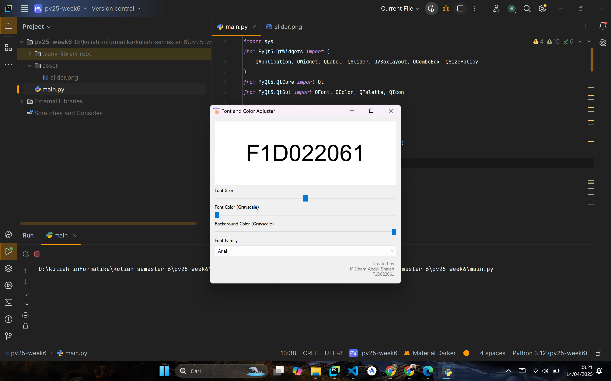

# Aplikasi Font and Color Adjuster Berbasis PyQt5

## 👤 Data Mahasiswa

| Nama                  | NIM         |
|-----------------------|-------------|
| M. ILHAM ABDUL SHALEH | F1D022061   |

---

## 🛠️ Teknologi yang Digunakan

- Python 3.10+
- PyQt5

---

## 📋 Fitur Utama

| Fitur                                                                          | Status     |
|--------------------------------------------------------------------------------|------------|
| Slider untuk mengatur ukuran font (20–60 pt)                                   | ✅ Selesai |
| Slider untuk mengatur warna teks                                               | ✅ Selesai |
| Slider untuk mengatur warna latar belakang                                     | ✅ Selesai |
| Dropdown untuk memilih jenis font                                              | ✅ Selesai |
 

---

## 🖼️ Screenshot Tampilan Aplikasi

### Tampilan Utama Aplikasi

---
  
## 🧱 Catatan Pengembangan

Tugas ini merupakan implementasi GUI menggunakan PyQt5 dengan fitur interaktif untuk mengubah tampilan teks dan latar belakang. Aplikasi ini dibuat dengan komponen berikut:

- Penggunaan `QSlider` untuk kontrol numerik
- Penggunaan `QComboBox` untuk memilih opsi font
- Pemanfaatan `QLabel` dengan `QFont`, `QPalette`, dan `QColor`

---

